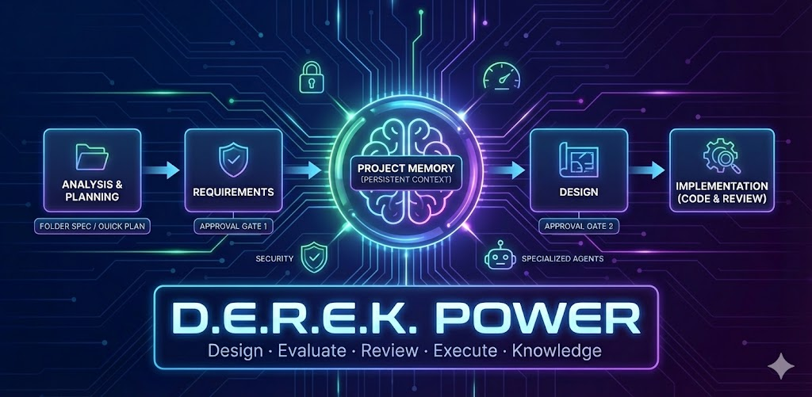

# D.E.R.E.K Power
**D**esign · **E**valuate · **R**eview · **E**xecute · **K**nowledge

A Kiro Power that enforces structured analysis, planning, approval, and review for all development tasks. No vibe coding. Strong focus on security, maintainability, and persistent context retention.

## What Makes D.E.R.E.K Different?

Unlike typical AI coding assistants that jump straight into code generation, D.E.R.E.K enforces a disciplined workflow that prevents common pitfalls:

### The Problem with "Vibe Coding"
- 🚫 AI generates code based on vague requirements
- 🚫 No validation that the solution matches actual needs
- 🚫 Context lost between sessions
- 🚫 Security and quality issues discovered too late
- 🚫 Repeated mistakes because learnings aren't captured

### The D.E.R.E.K Solution
- ✅ **Approval gates** prevent wasted work on misunderstood requirements
- ✅ **Persistent memory** maintains context across sessions
- ✅ **Security-first** approach with built-in review processes
- ✅ **Knowledge accumulation** so you don't repeat mistakes
- ✅ **Structured planning** with clear requirements → design → implementation flow

Think of it as "working memory on disk" - your project context persists and evolves, not just in the AI's ephemeral context window.

## Overview

D.E.R.E.K transforms your development workflow by:

1. **Analyzing** tasks before jumping into code
2. **Planning** with persistent markdown files as "working memory on disk"
3. **Requiring approval** before implementation (approval gates)
4. **Reviewing** code for quality and security after implementation
5. **Retaining knowledge** across sessions with a project memory system

## Key Features

### 🧠 Project Memory System

Persistent markdown files in `.kiro/resources/` that maintain context across sessions:

- **PROJECT.md** - Project overview, tech stack, architecture
- **PROGRESS.md** - Current task tracking and status
- **DECISIONS.md** - Key decisions with rationale
- **KNOWLEDGE.md** - Finalized learnings and patterns
- **SCRATCHPAD.md** - Temporary working notes

**Memory Sharing via MCP:**
D.E.R.E.K includes the [derek-memory MCP server](https://github.com/dereknguyen269/derek-memory-mcp) that exposes your project memory as resources and provides tools to generate beautiful HTML documentation. Share specs with your team or view them in a browser with automatic sensitive data sanitization.

### 📋 Two Planning Modes

#### Quick Planning
For simple tasks, bug fixes, and small changes:
- Uses `.kiro/resources/PROGRESS.md`
- Lightweight phase tracking
- Quick iteration

#### Folder Spec Planning
For complex specifications requiring multiple files/components:
- Uses `.kiro/features/<spec-name>/` folders
- Structured requirements → design → tasks workflow
- Approval gates at each phase
- Temporary knowledge capture during implementation

### 🚦 Approval Gates

Prevents wasted work on misunderstood requirements:
- ⛔ Requirements must be approved before design
- ⛔ Design must be approved before implementation
- Explicit human approval required at each gate

### 🔒 Security-First Approach

Built-in security awareness with specialized steering files for:
- Secure coding practices
- Code review with security focus
- Security audits and compliance
- Backend security implementation

## Quick Start

### Initialize Project Memory

```bash
# Say to Kiro:
"init"
```

This creates the project memory system and analyzes your codebase.

### Create a Folder Spec

```bash
# Say to Kiro:
"create spec authentication"
```

This creates `.kiro/features/authentication/` with:
- `requirements.md` - What to build
- `design.md` - How to build (after requirements approved)
- `tasks.md` - Implementation tracking (after design approved)
- `notes.md` - Temporary knowledge during implementation

### Approval Workflow

```bash
# After reviewing requirements.md:
"approve requirements"

# After reviewing design.md:
"approve design"

# After implementation complete:
"complete spec"
```

## Folder Spec Structure

```
.kiro/
├── resources/                    # Global Project Memory
│   ├── PROJECT.md               # Project overview
│   ├── PROGRESS.md              # Current task tracking
│   ├── DECISIONS.md             # Decision log
│   ├── KNOWLEDGE.md             # Finalized learnings
│   └── SCRATCHPAD.md            # Temporary notes
│
└── features/                     # Folder Specifications
    ├── authentication/           # Example spec
    │   ├── requirements.md      # WHAT to build
    │   ├── design.md            # HOW to build
    │   ├── tasks.md             # Implementation tracking
    │   └── notes.md             # Temporary knowledge
    │
    └── payment-integration/      # Another spec
        ├── requirements.md
        ├── design.md
        ├── tasks.md
        └── notes.md
```

## Workflow Diagram

```
┌─────────────┐     ┌─────────────┐     ┌─────────────┐     ┌─────────────┐
│ Requirements│────►│   Design    │────►│   Tasks     │────►│  Implement  │
│   (WHAT)    │     │   (HOW)     │     │  (TRACK)    │     │   (CODE)    │
└─────────────┘     └─────────────┘     └─────────────┘     └─────────────┘
       │                   │                                       │
       ▼                   ▼                                       ▼
  ⛔ APPROVAL         ⛔ APPROVAL                            📝 notes.md
     GATE                GATE                               (temp knowledge)
                                                                   │
                                                                   ▼
                                                            Transfer to
                                                            KNOWLEDGE.md
```

## Commands

### Memory System
- `init` - Initialize project memory system
- `reinit` - Refresh PROJECT.md only (preserves other files)
- `share memory` - Generate shareable HTML documentation
- `serve memory` - Start HTTP server to view HTML in browser (http://localhost:8080)

### Folder Spec Planning
- `create spec [name]` - Create new folder spec
- `approve requirements` - Proceed to design phase
- `approve design` - Proceed to implementation phase
- `complete spec` - Finalize and transfer learnings

### Status
- `show spec status` - Display current spec progress
- `update task [ID]` - Update specific task status

## Steering Files

D.E.R.E.K includes comprehensive steering files organized by category:

### Workflow Files
- `analysis.md` - Task analysis framework
- `planning.md` - Planning framework (quick & folder spec)
- `review.md` - Post-implementation review
- `context.md` - Context retention across sessions
- `derek-init.md` - Project initialization

### Core Quality Agents
- `core.code-archaeologist.md` - Deep codebase exploration
- `core.code-reviewer.md` - Security-aware code review
- `core.debugger.md` - Error resolution & debugging
- `core.performance-optimizer.md` - Performance optimization

### Specialized Agents
- **Go**: `specialized.golang-pro.md`
- **Python**: 9 agents (Django, FastAPI, ML/Data, Testing, Security, etc.)
- **Rails**: 3 agents (Backend, API, ActiveRecord)
- **React**: 2 agents (Component Architect, Next.js)
- **Vue**: 3 agents (Component Architect, Nuxt, State Manager)
- **TypeScript**: `specialized.typescript-pro.md`
- **Data & AI**: 8 agents (AI Engineer, Data Engineer, Database Optimizer, etc.)

### Infrastructure & DevOps
- `infrastructure.cloud-architect.md`
- `infrastructure.deployment-engineer.md`
- `infrastructure.devops-incident-responder.md`
- `infrastructure.performance-engineer.md`

### Security
- `security-auditor.md` - Comprehensive security audits
- Backend security coding practices built-in

## D.E.R.E.K vs Kiro Native Specs

### What's the Difference?

**Kiro Native Specs** are built into Kiro and provide a structured way to build features with requirements, design, and implementation phases. They're great for formal feature development.

**D.E.R.E.K** extends this concept with additional capabilities focused on persistent memory, security, and knowledge retention:

| Feature | Kiro Native Specs | D.E.R.E.K |
|---------|------------------|-----------|
| **Requirements → Design → Implementation** | ✅ Yes | ✅ Yes |
| **Approval Gates** | ✅ Yes | ✅ Yes |
| **Persistent Project Memory** | ❌ No | ✅ Yes (PROJECT.md, KNOWLEDGE.md, etc.) |
| **Cross-Session Context** | ⚠️ Limited | ✅ Strong (memory system) |
| **Knowledge Accumulation** | ❌ No | ✅ Yes (learnings persist) |
| **Security-First Workflow** | ⚠️ Basic | ✅ Built-in (security steering files) |
| **Temporary Notes During Work** | ❌ No | ✅ Yes (notes.md → KNOWLEDGE.md) |
| **Decision Logging** | ❌ No | ✅ Yes (DECISIONS.md) |
| **Quick Planning Mode** | ❌ No | ✅ Yes (PROGRESS.md) |
| **Specialized Agent Roles** | ❌ No | ✅ Yes (70+ steering files) |
| **Memory Sharing** | ❌ No | ✅ Yes (HTML export) |

### When to Use Each

**Use Kiro Native Specs When:**
- ✅ You want the standard Kiro workflow
- ✅ Your project doesn't need persistent memory
- ✅ You're working on isolated features
- ✅ Context retention isn't critical

**Use D.E.R.E.K When:**
- ✅ You need context to persist across sessions
- ✅ Security is a primary concern
- ✅ You want to accumulate project knowledge over time
- ✅ You need specialized agent roles (Python, Rails, React, etc.)
- ✅ You want to track decisions and learnings
- ✅ You're working on complex, multi-session projects
- ✅ You need both quick planning and formal specs

### Can They Work Together?

Yes! D.E.R.E.K complements Kiro's native specs:
- Use D.E.R.E.K's memory system (PROJECT.md, KNOWLEDGE.md) alongside native specs
- Use D.E.R.E.K's security and specialized steering files with any workflow
- Use D.E.R.E.K's quick planning for small tasks, native specs for formal features

Think of D.E.R.E.K as "Kiro specs + persistent memory + security focus + knowledge retention"

## When to Use

### Use Folder Spec Planning For:
- ✅ New features requiring multiple files/components
- ✅ Authentication, authorization systems
- ✅ API endpoints with complex logic
- ✅ Database schema changes
- ✅ Integration with external services
- ✅ Refactoring major components
- ✅ Work spanning multiple sessions

### Use Quick Planning For:
- ✅ Bug fixes
- ✅ Single-file changes
- ✅ Configuration updates
- ✅ Documentation updates

## Benefits

### Prevents Common Problems
- ❌ No more coding based on misunderstood requirements
- ❌ No more forgetting context between sessions
- ❌ No more repeating the same mistakes
- ❌ No more security vulnerabilities from rushed code

### Enables Best Practices
- ✅ Structured analysis before coding
- ✅ Clear implementation guidance
- ✅ Transparent progress tracking
- ✅ Knowledge accumulation over time
- ✅ Effective handoffs between sessions
- ✅ Security-first development

## Example: Authentication Spec

### 1. Create Spec
```
"create spec authentication"
```

### 2. Requirements Phase
Kiro generates `requirements.md` with:
- Problem statement
- User stories
- Functional requirements
- Non-functional requirements
- Security requirements

### 3. Approval Gate
```
"approve requirements"
```

### 4. Design Phase
Kiro generates `design.md` with:
- Architecture overview
- Data model
- API design
- Security design
- Testing strategy

### 5. Approval Gate
```
"approve design"
```

### 6. Implementation Phase
Kiro generates `tasks.md` with:
- Phased task breakdown
- Dependencies
- Estimates
- Acceptance criteria

Work through tasks, capturing discoveries in `notes.md`

### 7. Completion
```
"complete spec"
```

Transfers valuable learnings from `notes.md` to `KNOWLEDGE.md`

## Integration with Project Memory

Folder specs integrate seamlessly with the global project memory:

- **PROJECT.md** provides architecture context for all specs
- **PROGRESS.md** links to active specs
- **DECISIONS.md** receives decisions from spec implementations
- **KNOWLEDGE.md** receives finalized learnings after spec completion

## File References

Specs can reference other files using `#[[file:path]]` syntax:

```markdown
## References
- #[[file:.kiro/resources/PROJECT.md]] - Project architecture
- #[[file:app/api/v1/base.rb]] - API base class
- #[[file:docs/api-spec.yaml]] - OpenAPI specification
```

This allows specs to:
- Reference existing code patterns
- Link to API specifications
- Include external documentation
- Connect to project context

## Best Practices

### Working with Kiro Sessions

#### When to Start a New Chat Session
- ✅ **After completing a major feature or spec** - Clean slate for new work
- ✅ **When switching to unrelated tasks** - Keep context focused
- ✅ **When context feels cluttered** - Too many tangents or failed attempts
- ✅ **After long debugging sessions** - Fresh perspective on new problems
- ✅ **When hitting context limits** - Kiro will warn you, but be proactive

#### When to Continue the Same Session
- ✅ **Working on related tasks** - Building on previous context
- ✅ **Iterating on the same feature** - Refinements and adjustments
- ✅ **Following up on reviews** - Addressing feedback from previous work
- ✅ **Within the same spec** - Requirements → Design → Implementation flow

#### Managing Long Sessions with D.E.R.E.K

**The Problem:** Long chat sessions can lose context, repeat mistakes, or become unfocused.

**D.E.R.E.K's Solution:** Persistent memory means you can start fresh sessions without losing context!

**Best Practices:**
1. **Update memory files regularly** - Write to PROJECT.md, PROGRESS.md, KNOWLEDGE.md as you work
2. **Complete specs properly** - Use `complete spec` to transfer learnings before starting new sessions
3. **Log decisions immediately** - Add to DECISIONS.md when making architectural choices
4. **Use SCRATCHPAD.md for temporary notes** - Brain dump during long sessions
5. **Start new sessions confidently** - Your project memory persists across sessions

**Example Workflow:**
```
Session 1: "init" → Analyze codebase → Update PROJECT.md
Session 2: "create spec authentication" → Requirements → Approve
Session 3: Continue spec → Design → Approve → Start implementation
Session 4: Complete implementation → "complete spec" → Transfer to KNOWLEDGE.md
Session 5: New feature, fresh session, but all context is in memory files!
```

#### Kiro Session Tips
- � **Use descriptive first messages** - "Continue authentication spec" vs "help"
- 🎯 **Stay focused per session** - One feature or problem at a time
- 🔄 **Reference memory files** - Say "check PROJECT.md" to reload context
- 🧹 **Clean up before ending** - Update PROGRESS.md with current status
- ⚡ **Start fresh when stuck** - New session + memory files = fresh perspective

#### D.E.R.E.K Hooks for Session Management

D.E.R.E.K includes hooks in `derek-power/hooks/` to help manage sessions:
- `auto-summary-on-context-limit.kiro.hook` - Auto-summarize when approaching limits
- `summary-session-command.kiro.hook` - Generate session summaries on demand
- `clear-chat-history.kiro.hook` - Clean slate while preserving memory

These hooks ensure you never lose important context even when starting new sessions.

### 1. Always Initialize
Run `init` before starting work on an unfamiliar project

### 2. Respect Approval Gates
Never skip requirements or design approval - it prevents wasted work

### 3. One Folder Per Spec
Keep specs focused and manageable

### 4. Update Progress Continuously
Mark tasks complete immediately, log errors as they occur

### 5. Transfer Knowledge
Move valuable discoveries from `notes.md` to `KNOWLEDGE.md` after completion

### 6. Link to Global Memory
Reference PROJECT.md for context, update KNOWLEDGE.md with learnings

### 7. Use Memory Sharing for Collaboration
D.E.R.E.K includes the [derek-memory MCP server](https://github.com/dereknguyen269/derek-memory-mcp) for sharing project specifications:

**Generate HTML Documentation:**
```
"share memory"
```

This creates a beautiful HTML file with all your project specs, requirements, design docs, and tasks.

**View in Browser:**
```
"serve memory"
```

Opens at `http://localhost:8080/` - perfect for:
- 📤 Sharing specs with team members
- 👀 Reviewing project progress in a clean UI
- 📋 Presenting designs to stakeholders
- 🔄 Onboarding new developers

**What Gets Shared:**
- PROJECT.md - Project overview and architecture
- PROGRESS.md - Current task tracking
- DECISIONS.md - Decision log with rationale
- KNOWLEDGE.md - Accumulated learnings
- All folder specs (requirements, design, tasks, notes)

**Security Note:** The MCP server automatically sanitizes sensitive data (API keys, passwords, tokens) before generating HTML.

**MCP Configuration:**
The derek-memory MCP is already configured in `derek-power/mcp.json`. It auto-detects your `.kiro` folder and works across all your projects with a single configuration.

## Installation

### Option 1: Install from GitHub (Recommended)

1. Clone the repository:
```bash
git clone https://github.com/dereknguyen269/derek-power.git
```

2. Copy the `derek-power` folder to your Kiro powers directory:
```bash
# macOS/Linux
cp -r derek-power/derek-power ~/.kiro/powers/

# Or manually copy to your Kiro workspace .kiro/powers/ directory
```

3. Restart Kiro or reload powers from the command palette

4. Verify installation by saying to Kiro:
```
"init"
```

### Option 2: Manual Installation

1. Download the power from: https://github.com/dereknguyen269/derek-power/tree/main/derek-power
2. Place the `derek-power` folder in your Kiro powers directory:
   - User-level: `~/.kiro/powers/derek-power/`
   - Workspace-level: `<workspace>/.kiro/powers/derek-power/`
3. Restart Kiro or reload powers

### Activation

D.E.R.E.K activates automatically when you use keywords like:
- "init", "initialize project"
- "create spec", "spec planning"
- "approve requirements", "approve design"
- "analyze task", "review code"
- "share memory", "show spec status"

## Version

Current version: 0.1.0

## License

[Your license here]

## Contributing

[Your contribution guidelines here]
