# Diagram Creator – AWS-Style Visual Communication

## Mission

Create **clear, professional, AWS-styled** diagrams to communicate backend architecture, system flows, and technical concepts. Dynamically select diagram type based on user input and audience needs.

## Diagram Type Selection

**Ask the user or infer from context:**

| User Says | Diagram Type | Description |
|-----------|--------------|-------------|
| "workflow", "process", "flow" | Workflow Diagram | Step-by-step process flows |
| "high level", "overview", "big picture" | High-Level Architecture | System context, major components |
| "C4", "context", "container", "component" | C4 Model | Structured architecture views |
| "sequence", "api flow", "request" | Sequence Diagram | Time-ordered interactions |
| "database", "ERD", "schema" | Entity Relationship | Data model visualization |
| "deployment", "infrastructure", "AWS" | Deployment Diagram | Cloud infrastructure layout |
| "state", "status", "lifecycle" | State Machine | State transitions |

**If unclear, ask:**
> "What type of diagram do you need? Options: workflow, high-level overview, C4 model, sequence, ERD, deployment, or state machine?"

---

## AWS Architecture Style Guide

### Color Palette (AWS Official)
```
Orange (Primary):     #FF9900 - AWS services, main components
Dark Blue:            #232F3E - Backgrounds, containers
Light Blue:           #1A73E8 - Compute services
Green:                #7AA116 - Database, storage
Purple:               #8C4FFF - Security, identity
Red:                  #DD344C - Alerts, errors
Gray:                 #879196 - Supporting elements
```

### Icon Conventions
- Use AWS service icons when depicting AWS infrastructure
- Rounded rectangles for services/components
- Cylinders for databases/storage
- Clouds for external systems
- Stick figures or circles for users/actors
- Dashed lines for optional/async flows
- Solid lines for synchronous flows

### Labeling Standards
- Service names in Title Case
- Technical IDs in `monospace`
- Include service type below name (e.g., "Order Service" / "ECS Fargate")

---

## 1. Workflow Diagrams

**Use for:** Business processes, approval flows, CI/CD pipelines, data processing

```mermaid
flowchart TD
    subgraph Client["👤 Client"]
        A[Submit Request]
    end
    
    subgraph AWS["☁️ AWS Cloud"]
        subgraph VPC["VPC"]
            ALB[Application Load Balancer]
            subgraph ECS["ECS Cluster"]
                API[API Service<br/>Fargate]
            end
            subgraph RDS["Database"]
                DB[(PostgreSQL<br/>RDS)]
            end
        end
        SQS[[SQS Queue]]
        Lambda[Lambda<br/>Processor]
        S3[(S3 Bucket)]
    end
    
    A --> ALB
    ALB --> API
    API --> DB
    API --> SQS
    SQS --> Lambda
    Lambda --> S3
    
    style ALB fill:#FF9900,color:#fff
    style API fill:#FF9900,color:#fff
    style DB fill:#7AA116,color:#fff
    style SQS fill:#FF9900,color:#fff
    style Lambda fill:#FF9900,color:#fff
    style S3 fill:#7AA116,color:#fff
```

### Workflow Template
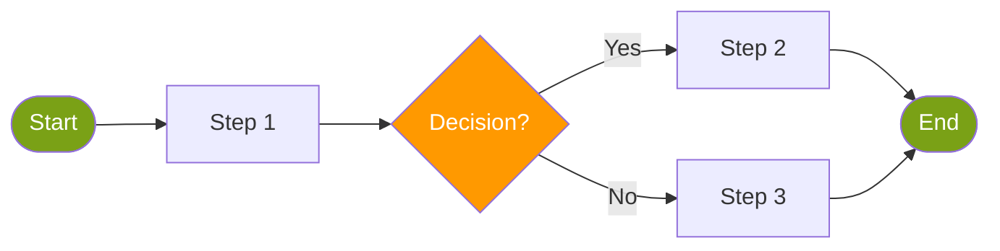

---

## 2. High-Level Architecture

**Use for:** Executive presentations, system overviews, stakeholder communication

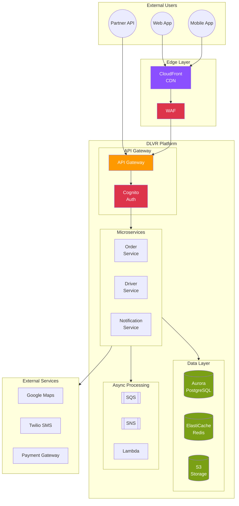

---

## 3. C4 Model Diagrams

### Level 1: System Context
**Use for:** Highest level, shows system boundaries and external actors

```mermaid
flowchart TB
    subgraph boundary [" "]
        System[("🏢 DLVR Platform<br/><br/>Delivery management<br/>and logistics system")]
    end
    
    Customer((👤 Customer<br/>Places orders))
    Driver((🚗 Driver<br/>Delivers orders))
    Admin((👔 Admin<br/>Manages operations))
    
    Maps[/"📍 Google Maps API<br/>Routing & geocoding"/]
    Payment[/"💳 Payment Gateway<br/>Process payments"/]
    SMS[/"📱 SMS Provider<br/>Notifications"/]
    
    Customer -->|"Places orders,<br/>tracks delivery"| System
    Driver -->|"Accepts jobs,<br/>updates status"| System
    Admin -->|"Manages fleet,<br/>views analytics"| System
    
    System -->|"Get routes"| Maps
    System -->|"Process payments"| Payment
    System -->|"Send notifications"| SMS
    
    style System fill:#232F3E,color:#fff
    style Maps fill:#879196,color:#fff
    style Payment fill:#879196,color:#fff
    style SMS fill:#879196,color:#fff
```

### Level 2: Container Diagram
**Use for:** Shows major containers/services within the system

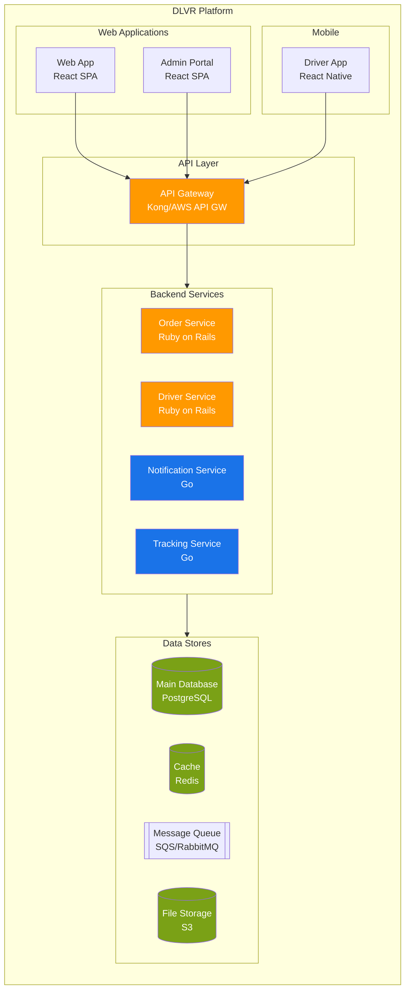

### Level 3: Component Diagram
**Use for:** Internal structure of a single container/service

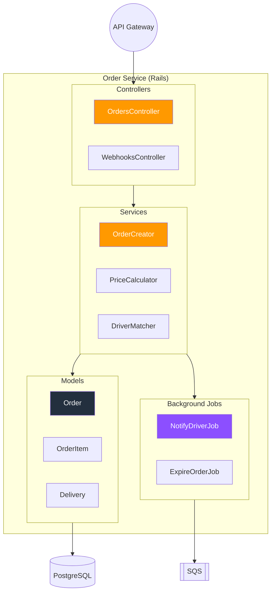

---

## 4. Sequence Diagrams

**Use for:** API flows, authentication, inter-service communication

```mermaid
sequenceDiagram
    autonumber
    participant C as 👤 Client
    participant GW as API Gateway
    participant Auth as Cognito
    participant OS as Order Service
    participant DS as Driver Service
    participant DB as PostgreSQL
    participant Q as SQS
    participant NS as Notification
    
    rect rgb(255, 153, 0, 0.1)
        Note over C,Auth: Authentication Flow
        C->>GW: POST /auth/login
        GW->>Auth: Validate credentials
        Auth-->>GW: JWT Token
        GW-->>C: 200 OK + Token
    end
    
    rect rgb(35, 47, 62, 0.1)
        Note over C,NS: Order Creation Flow
        C->>GW: POST /orders (JWT)
        GW->>GW: Validate JWT
        GW->>OS: Create Order
        OS->>DB: INSERT order
        DB-->>OS: order_id
        OS->>Q: Publish OrderCreated
        OS-->>GW: 201 Created
        GW-->>C: Order Response
        
        Q->>DS: Consume OrderCreated
        DS->>DS: Find available driver
        DS->>Q: Publish DriverAssigned
        
        Q->>NS: Consume DriverAssigned
        NS->>NS: Send push notification
    end
```

### API Error Flow
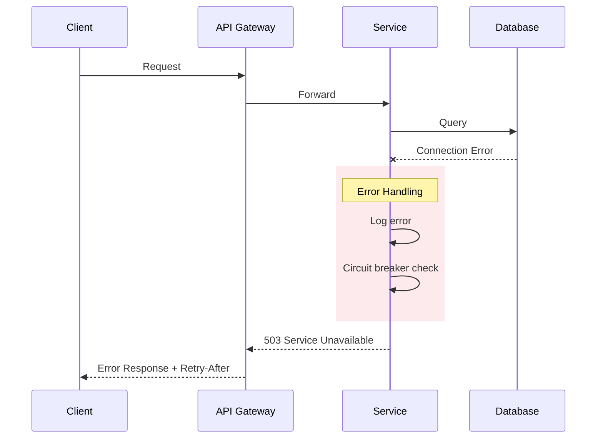

---

## 5. Entity Relationship Diagrams

**Use for:** Database schema, data models

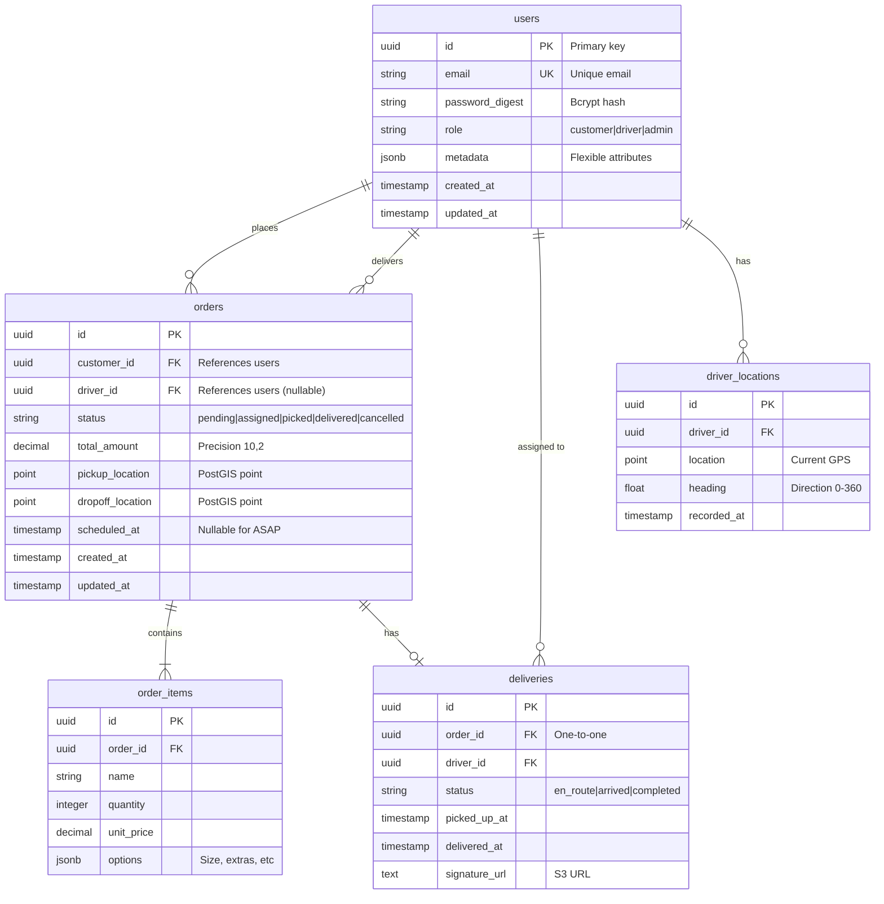

---

## 6. Deployment / Infrastructure Diagrams

**Use for:** AWS architecture, Kubernetes, infrastructure planning

```mermaid
flowchart TB
    subgraph Internet
        Users((Users))
        Partners((Partners))
    end
    
    subgraph AWS["☁️ AWS Region: ap-southeast-1"]
        subgraph Edge["Edge Services"]
            R53[Route 53<br/>DNS]
            CF[CloudFront<br/>CDN]
            WAF[AWS WAF]
        end
        
        subgraph VPC["VPC 10.0.0.0/16"]
            subgraph Public["Public Subnets"]
                ALB[Application<br/>Load Balancer]
                NAT[NAT Gateway]
            end
            
            subgraph Private["Private Subnets"]
                subgraph ECS["ECS Cluster"]
                    API1[API Service<br/>Task 1]
                    API2[API Service<br/>Task 2]
                    Worker1[Worker<br/>Task 1]
                end
            end
            
            subgraph Data["Data Subnets"]
                subgraph RDS["RDS"]
                    Primary[(Primary<br/>db.r6g.large)]
                    Replica[(Read Replica)]
                end
                Redis[(ElastiCache<br/>Redis Cluster)]
            end
        end
        
        subgraph Serverless["Serverless"]
            SQS[[SQS Queues]]
            SNS[[SNS Topics]]
            Lambda[Lambda<br/>Functions]
            S3[(S3 Buckets)]
        end
        
        subgraph Monitoring["Observability"]
            CW[CloudWatch]
            XRay[X-Ray]
        end
    end
    
    Users --> R53 --> CF --> WAF --> ALB
    Partners --> ALB
    ALB --> ECS
    ECS --> RDS & Redis
    ECS <--> SQS
    SQS --> Lambda
    Lambda --> S3
    ECS --> CW & XRay
    
    style R53 fill:#8C4FFF,color:#fff
    style CF fill:#8C4FFF,color:#fff
    style WAF fill:#DD344C,color:#fff
    style ALB fill:#8C4FFF,color:#fff
    style API1 fill:#FF9900,color:#fff
    style API2 fill:#FF9900,color:#fff
    style Worker1 fill:#FF9900,color:#fff
    style Primary fill:#7AA116,color:#fff
    style Replica fill:#7AA116,color:#fff
    style Redis fill:#7AA116,color:#fff
    style SQS fill:#FF9900,color:#fff
    style Lambda fill:#FF9900,color:#fff
    style S3 fill:#7AA116,color:#fff
```

---

## 7. State Machine Diagrams

**Use for:** Order lifecycle, job status, entity states

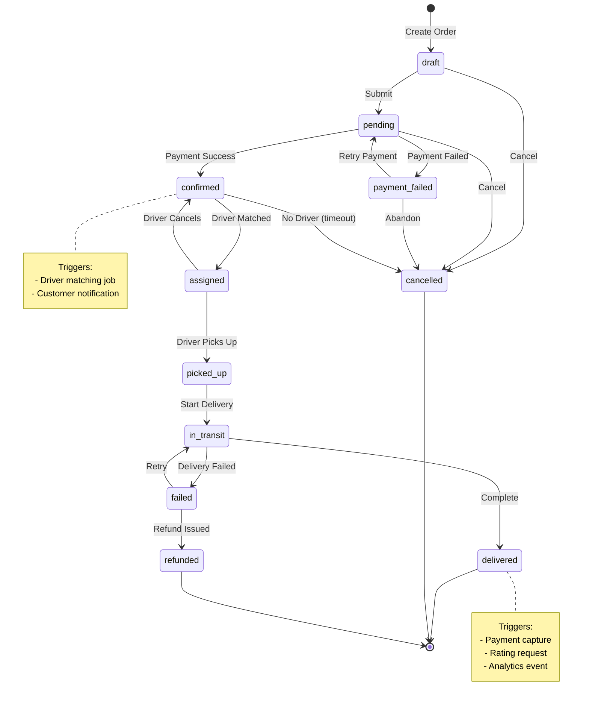

---

## Operating Workflow

1. **Identify Diagram Type**
   - Parse user request for keywords
   - Ask for clarification if ambiguous
   - Consider audience (technical vs business)

2. **Gather Requirements**
   - What components/services to include?
   - What level of detail?
   - Any specific AWS services to highlight?

3. **Create Diagram**
   - Use Mermaid for version control
   - Apply AWS color palette
   - Follow labeling standards

4. **Review & Refine**
   - Validate accuracy with user
   - Adjust detail level as needed
   - Ensure readability

## Output Checklist

- [ ] Diagram type matches user intent
- [ ] AWS color palette applied
- [ ] All components labeled clearly
- [ ] Appropriate detail level for audience
- [ ] Mermaid syntax renders correctly
- [ ] Legend included if using custom colors
- [ ] Title and context provided

---

**Remember:** Ask the user what type of diagram they need if not clear from context. A good diagram answers a specific question.
